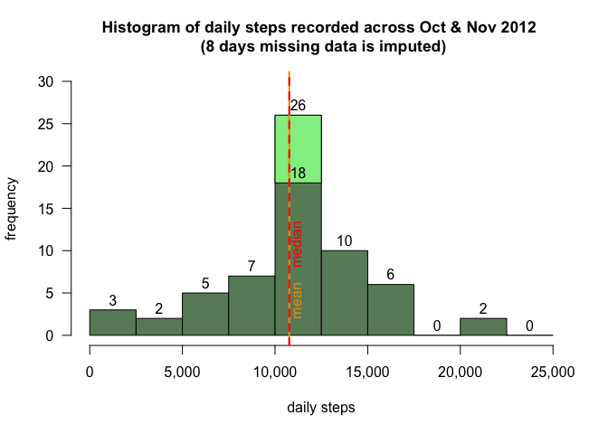

# Reproducible Research - Peer Assessment 1

## Introduction
This assignment is part of the Reproducible Research module of the John Hopkins Data Science Specialization on Coursera.  This assignment answers a series of questions using data provided which is taken from a personal activity monitoring device.  The purpose of the assignment is to demonstrate an understanding of how to use R Markdown to set out analysis in a reproducible way.

#### 0. Loading and preprocessing the data
To set up the r environment first install the tidyverse package to enable access to tidyr and dplyr for data manipulation:

```r
# install.packages("tidyverse")
library(tidyverse)
```

The data for this assignment is made available at  *https://d396qusza40orc.cloudfront.net/repdata%2Fdata%2Factivity.zip*
To download the data and read it into a data table use the following code:

```r
download.file("https://d396qusza40orc.cloudfront.net/repdata%2Fdata%2Factivity.zip",
              "activity.zip", method = "curl")
unzip("activity.zip")
data0 <- read.csv("activity.csv", header = TRUE)
```

Now process the **date** variable to ensure it is recorded in Date format:

```r
data0$date <- as.Date(data0$date, format = "%Y-%m-%d")
```

The **data0** datatable has 3 variables and 17,568 observations.  It is used as the basis for the rest of this analysis.
<br>

## Analysis

The following questions are answered in this analysis section, supported by various plots as required:  

1. What is mean total number of steps taken per day? 
2. What is the average daily activity pattern? 
3. How to impute missing values?
4. Are there differences in activity patterns between weekdays and weekends? 

<br>

#### 1. What is mean total number of steps taken per day?

To answer this question look at the mean and the median steps per day, as well as the distribution of the daily steps over the two month period.  

Firstly create a dataset by grouping by **date** in order to summarise across each day, then calculating the sum of steps across each day.  (Note the use of the piping operator **%>%** which comes with the dplyr package):

```r
daily1 <- data0 %>% 
        group_by(date) %>% 
        summarise(steps = sum(steps, na.rm = TRUE)) %>% 
        ungroup()

head(daily1, 5)
```

```
## # A tibble: 5 × 2
##   date       steps
##   <date>     <int>
## 1 2012-10-01     0
## 2 2012-10-02   126
## 3 2012-10-03 11352
## 4 2012-10-04 12116
## 5 2012-10-05 13294
```

The mean and median steps per day can then be calculated from this summary dataset using the **summary** function:  

```r
summary(daily1$steps, na.rm = TRUE)
```

```
##    Min. 1st Qu.  Median    Mean 3rd Qu.    Max. 
##       0    6778   10395    9354   12811   21194
```
The mean is 9,354.23, the median is 10,395, this implis the distribution is left skewed.  There are 8 days with missing values which are currently recorded as 0 steps on those days.  

To get a better understanding of the distribution plot a histogram using r's base plotting functionality.  Use the **hist** function and then add a formatted x-axis, a count label for each bucket, and a line and label for the mean:

```r
# plot main histogram
h1 <- hist(daily1$steps, 
      breaks = seq(0,25000,by = 2500), 
      ylim = c(0,20),
      col = "steelblue3",
      main = "Histogram of daily steps recorded across Oct & Nov 2012 \n (8 days missing data treated as 0)",
      cex.main = 1.1,
      xlab = "daily steps", 
      ylab = "frequency",
      xaxt = "n",       # remove x-axis to reformat
      las = 1)          # horizontal y-axis tick labels

# add comma separated numbers to x-axis
axis(1, 
     at = seq(0, 25000, by = 5000), 
     labels = prettyNum(axTicks(1), 
     big.mark = ","))

# add count label to each bucket
text(x = h1$mids, 
     y = h1$counts, 
     labels = h1$counts, 
     adj = c(0.5, -0.5)) 

# add a line to show the mean
abline(v = mean(daily1$steps, na.rm = TRUE), 
     col = "orange3", 
     lty = 2, 
     lwd = 2)

# add a label for the mean
text(x = mean(daily1$steps, na.rm = TRUE), 
     y = 10, 
     labels = "mean", 
     col = "orange3", 
     srt = 90,        # rotate 90 degrees
     cex = 1,         # resize 
     pos = 4,         # move to right of line
     offset = 0.5)    # distance from line

# add a line to show the median
abline(v = median(daily1$steps, na.rm = TRUE), 
     col = "red2", 
     lty = 2, 
     lwd = 2)

# add a label for the mean
text(x = median(daily1$steps, na.rm = TRUE), 
     y = 10, 
     labels = "median", 
     col = "red2", 
     srt = 90,        # rotate 90 degrees
     cex = 1,         # resize 
     pos = 4,         # move to right of line
     offset = 0.5)    # distance from line

# record where the NA zeros impact the plot
y1zero <- h1$counts[1] - sum((daily1$steps) == 0)
y1total <- h1$counts[1]

# add a transparent square to show the 0's
x1 <- c(0, 0, 2500, 2500)
y1 <- c(y1zero, y1total, y1total, y1zero)
polygon(x1,y1,col = "lightskyblue")

# add a another label show the 0's
text(x = h1$mids[1], 
     y = y1zero,
     labels = y1zero, 
     adj = c(0.5, -0.5)) 
```


The histogram shows that the data is actually bell-shaped with a collection of 3 low (but non-zero) days at 0-2500 steps, and 2 high days of over 20,000 steps.  The mean is less than the median, but this is being impacted by the 8 zero values from missing data.  The significant peak at the median/mean could be to do with the common target of achieving 10,000 steps per day on smartphone devices.

<br>

#### 2. What is the average daily activity pattern?

To answer this question look at the average profile of steps across the day in five minute intervals.  First construct a dataset which is grouped by 5-minute intervals and then summarise by the average steps across the 2 months for each 5-minute interval:


```r
interval1 <- data0 %>% 
                group_by(interval) %>% 
                summarise(avg.steps = mean(steps, na.rm = TRUE)) %>%
                ungroup()

head(interval1, 5)
tail(interval1, 5)
```


```
## # A tibble: 5 × 2
##   interval avg.steps
##      <int>     <dbl>
## 1        0    1.72  
## 2        5    0.340 
## 3       10    0.132 
## 4       15    0.151 
## 5       20    0.0755
```

```
## # A tibble: 5 × 2
##   interval avg.steps
##      <int>     <dbl>
## 1     2335     4.70 
## 2     2340     3.30 
## 3     2345     0.642
## 4     2350     0.226
## 5     2355     1.08
```

Note that the intervals provided are in a format **hmm** which needs to be manipulated in order to plot and label correctly.  Firstly add a timestring in format **HH:MM**, then convert the intervals provided into **mm** (minutes) rather than **hmm** (hoursminutes), finally reorder columns to keep observations on the right:


```r
# extract interval as a 4 digit timestamp HHMM
timestr <- str_pad(interval1$interval, 4, pad = 0)

# add a ':' so it looks more like a timestamp
interval1$string <- str_c(str_sub(timestr,1,2), rep(":", length(timestr)), str_sub(timestr,3,4))

# create a minutes variable which is number of minutes since midnight each day
interval1$minutes <- 60 * as.numeric(str_sub(timestr,1,2)) + as.numeric(str_sub(timestr,3,4))

# reorder columns
interval1 <- relocate(interval1, avg.steps, .after = last_col())

head(interval1, 5)
tail(interval1, 5)
```


```
## # A tibble: 5 × 4
##   interval string minutes avg.steps
##      <int> <chr>    <dbl>     <dbl>
## 1        0 00:00        0    1.72  
## 2        5 00:05        5    0.340 
## 3       10 00:10       10    0.132 
## 4       15 00:15       15    0.151 
## 5       20 00:20       20    0.0755
```

```
## # A tibble: 5 × 4
##   interval string minutes avg.steps
##      <int> <chr>    <dbl>     <dbl>
## 1     2335 23:35     1415     4.70 
## 2     2340 23:40     1420     3.30 
## 3     2345 23:45     1425     0.642
## 4     2350 23:50     1430     0.226
## 5     2355 23:55     1435     1.08
```

Use the **interval1** dataset to plot a timeline of average daily steps vs 5-minute intervals.  Make this timeline more legible by improving the tick marks and adding horizontal and vertical guidelines:


```r
# plot the initial timeline using minutes and average steps.
t1 <- plot(x = c(interval1$minutes,1440),
     y = c(interval1$avg.steps, NA),
     ylim = c(0, 250),
     xlab = "time of day",
     ylab = "average number of steps",
     main = "Average number of steps at five minute intervals \n (averaged across all days of Oct & Nov 2012)",
     type = "l",
     lwd = 2, 
     col = "steelblue3",
     xaxt = "n",      # remove x-axis to reformat later
     xaxs = "i",      # reduce x-axis to span values only (no margin)
     bty = "n",       # remove border
     las = 1)         # horizontal y-axis tick labels

# add in small 1-hourly tick marks 
axis(1, 
     at = seq(0, 1440, by = 60), 
     labels = FALSE, 
     tck = -0.02)           # tick mark size

# add in larger 3-hourly tick-marks and labels (final 24hr label added on manually)
seq1 <- seq(0, 1440/5, 180/5)    # create sequence for tick labels
axis(1, 
     at = seq(0, 1440, by = 180),
     labels = c(interval1$string[seq1[1:8]+1],"24:00"),    
     tck = -0.04)           # tick mark size

# add vertical gridlines
abline(v = seq(0, 1440, by = 180), 
     col = "grey", 
     lty = 3, 
     lwd = 1)

# add horizontal gridlines
abline(h = seq(0, 250, by = 50), 
     col = "grey", 
     lty = 3, 
     lwd = 1)
```


The timeline shows activity as follows 

| Time     |    Steps per 5-minute interval |  Activity level | Possible explanations |
| :------- | :----------- | :------- | :----------------------- |
| 5.30am - 6am | 0 to 50 steps/int | Increasing | Waking up between 5.30 and 6am |
| 6am - 8am | ~ 50 steps/int | Average | Morning routine - preparing for the day |
| 8am - 9am | ~ 175 steps/int | Very High | Walking commute, run, or visiting the gym |
| 9am - 3.30pm | 25 - 50 steps/int | Low to Average | Possibly sitting at desk or in meetings | 
| 12pm | ~100 steps/int | High | Lunchbreak |
| 3.30pm - 7.30pm | 50 - 100 steps/int | Average to High | Staggered evening commute and evening activities |
| 7.30pm - 10pm | 25 to 0 steps/int | Reducing | Less activities running into the evening, possibly late activity on some days only |
| 10pm - 12am | ~ 5 steps/int | Very Low | Only very occasional activity - maybe one or two late nights |
| 12am - 5.30am | ~ 0 steps/int | None | Asleep |

Now filter the **interval1** datatable to see that the maximum steps per interval is 206 occurring between 08:35 and 08:40:


```r
filter(interval1, avg.steps == max(avg.steps))
```

```
## # A tibble: 1 × 4
##   interval string minutes avg.steps
##      <int> <chr>    <dbl>     <dbl>
## 1      835 08:35      515      206.
```

<br>

#### 3. How to impute missing values?

As noted previously there are 8 days with missing values which were previously ignored.  Looking at the original **data0** datatable shows 2,304 missing values which is 13.1%  of the original data set.  (On review this appears to be 8 full days of data missing since there are 8 x 12 x 24 = 2,304 missing points, and there are 8 days with NA values in the **daily1** dataset).

Now replace these NA's with imputed values.  To impute the missing values use the average steps per interval for any given 5-minute interval (i.e. if there is a data point missing for a 07:00 to 07:05 interval then replace that missing value with the average of all other 07:00 to 07:05 intervals that have NA values).  Create a new datatable called **data1** with an additional column of computed observations called **steps.imp** (Note - keep this distinct from **data0** so that **data0** remains strictly a reflection of the uploaded .csv file):


```r
data1 <- data0 %>% 
            group_by(interval) %>% 
            mutate(steps.imp = ifelse(is.na(steps), mean(steps, na.rm = TRUE), steps)) %>% 
            relocate(steps, .after = interval) %>%
            ungroup()

head(data1, 5)
```

```
## # A tibble: 5 × 4
##   date       interval steps steps.imp
##   <date>        <int> <int>     <dbl>
## 1 2012-10-01        0    NA    1.72  
## 2 2012-10-01        5    NA    0.340 
## 3 2012-10-01       10    NA    0.132 
## 4 2012-10-01       15    NA    0.151 
## 5 2012-10-01       20    NA    0.0755
```

Now add a **steps.imp** column to the **daily1** datatable to reflect the day totals if the imputed steps observation is used to calculate daily totals:


```r
daily1 <- data1 %>% 
            group_by(date) %>% 
            summarise(steps = sum(steps, na.rm = TRUE), steps.imp = sum(steps.imp)) %>% 
            ungroup()

head(daily1, 10)
```

```
## # A tibble: 10 × 3
##    date       steps steps.imp
##    <date>     <int>     <dbl>
##  1 2012-10-01     0    10766.
##  2 2012-10-02   126      126 
##  3 2012-10-03 11352    11352 
##  4 2012-10-04 12116    12116 
##  5 2012-10-05 13294    13294 
##  6 2012-10-06 15420    15420 
##  7 2012-10-07 11015    11015 
##  8 2012-10-08     0    10766.
##  9 2012-10-09 12811    12811 
## 10 2012-10-10  9900     9900
```

It is easy to see that days without any data e.g. 2012-10-02 and 2012-10-08 have their totals replaced by the new mean of 10,766.19.  This mean has changed because it is now being taken across the non-NA values only.

The median becomes the same as the mean because the 8 missing values are now recorded as the mean.   


```r
summary(daily1$steps.imp)
```

```
##    Min. 1st Qu.  Median    Mean 3rd Qu.    Max. 
##      41    9819   10766   10766   12811   21194
```

This can be more easily seen by looking at looking at the histogram with the imputed values included: 


```r
# plot second histogram
h2 <- hist(daily1$steps.imp, 
      breaks = seq(0,25000,by = 2500), 
      ylim = c(0,30),
      col = "darkseagreen4",
      main = "Histogram of daily steps recorded across Oct & Nov 2012 \n (8 days missing data is imputed)",
      cex.main = 1.1,
      xlab = "daily steps", 
      ylab = "frequency",
      xaxt = "n",       # remove x-axis to reformat
      las = 1)          # horizontal y-axis tick labels

# add comma separated numbers to x-axis
axis(1, 
     at = seq(0, 25000, by = 5000), 
     labels = prettyNum(axTicks(1), 
     big.mark = ","))

# add count label to each bucket
text(x = h2$mids, 
     y = h2$counts, 
     labels = h2$counts, 
     adj = c(0.5, -0.5)) 

# record where the NA zeros impact the plot
y5zero <- h2$counts[5] - sum((daily1$steps) == 0)
y5total <- h2$counts[5]

# add a transparent square to show the 0's
x2 <- c(10000, 10000, 12500, 12500)
y2 <- c(y5zero, y5total, y5total, y5zero)
polygon(x2,y2,col = "palegreen2")

# add a another label show the 0's
text(x = h2$mids[5], 
     y = y5zero,
     labels = y5zero, 
     adj = c(0.5, -0.5)) 

# add a line to show the mean
abline(v = mean(daily1$steps.imp, na.rm = TRUE), 
     col = "orange2", 
     lty = 1, 
     lwd = 2)

# add a label for the mean
text(x = mean(daily1$steps.imp, na.rm = TRUE), 
     y = 2, 
     labels = "mean", 
     col = "orange2", 
     srt = 90,        # rotate 90 degrees
     cex = 1,         # resize 
     pos = 4,         # move to right of line
     offset = 0.5)    # distance from line

# add a line to show the median
abline(v = median(daily1$steps.imp, na.rm = TRUE), 
     col = "red", 
     lty = 2, 
     lwd = 2)

# add a label for the median
text(x = median(daily1$steps.imp, na.rm = TRUE), 
     y = 8, 
     labels = "median", 
     col = "red", 
     srt = 90,        # rotate 90 degrees
     cex = 1,         # resize 
     pos = 4,         # move to right of line
     offset = 0.5)    # distance from line
```




The distribution profile of daily totals now has a more exaggerated peak, this is because days which have no data have been replaced with the daily average.  Care should therefore be taken when using the imputed dataset as it may distort findings by including imputed data.

Given the missing data points occur for specific days, the best way of viewing the distribution of total steps across the two months is to ignore the missing values all together.  This is done by leaving the values as NA in the dataset:


```r
daily2 <- data0 %>% 
            group_by(date) %>% 
            summarise(steps = sum(steps)) %>% 
            ungroup()
daily1 <- cbind(daily1, steps.na = daily2$steps)
head(daily1, 10)
```

```
##          date steps steps.imp steps.na
## 1  2012-10-01     0  10766.19       NA
## 2  2012-10-02   126    126.00      126
## 3  2012-10-03 11352  11352.00    11352
## 4  2012-10-04 12116  12116.00    12116
## 5  2012-10-05 13294  13294.00    13294
## 6  2012-10-06 15420  15420.00    15420
## 7  2012-10-07 11015  11015.00    11015
## 8  2012-10-08     0  10766.19       NA
## 9  2012-10-09 12811  12811.00    12811
## 10 2012-10-10  9900   9900.00     9900
```

Then redraw the histogram noting that the missing days have been excluded from the plot:


```r
# plot main histogram
h3 <- hist(daily1$steps.na, 
      breaks = seq(0,25000,by = 2500), 
      ylim = c(0,20),
      col = "honeydew3",
      main = "Histogram of daily steps recorded across Oct & Nov 2012 \n (8 days missing data ignored)",
      cex.main = 1.1,
      xlab = "daily steps", 
      ylab = "frequency",
      xaxt = "n",       # remove x-axis to reformat
      las = 1)          # horizontal y-axis tick labels

# add comma separated numbers to x-axis
axis(1, 
     at = seq(0, 25000, by = 5000), 
     labels = prettyNum(axTicks(1), 
     big.mark = ","))

# add count label to each bucket
text(x = h3$mids, 
     y = h3$counts, 
     labels = h3$counts, 
     adj = c(0.5, -0.5)) 

# add a line to show the mean
abline(v = mean(daily1$steps.na, na.rm = TRUE), 
     col = "orange3", 
     lty = 1, 
     lwd = 2)

# add a label for the mean
text(x = mean(daily1$steps.na, na.rm = TRUE), 
     y = 2, 
     labels = "mean", 
     col = "orange3", 
     srt = 90,        # rotate 90 degrees
     cex = 1,         # resize 
     pos = 4,         # move to right of line
     offset = 0.5)    # distance from line

# add a line to show the median
abline(v = median(daily1$steps.na, na.rm = TRUE), 
     col = "red2", 
     lty = 2, 
     lwd = 2)

# add a label for the mean
text(x = median(daily1$steps.na, na.rm = TRUE), 
     y = 8, 
     labels = "median", 
     col = "red2", 
     srt = 90,        # rotate 90 degrees
     cex = 1,         # resize 
     pos = 4,         # move to right of line
     offset = 0.5)    # distance from line
```


This shows a truer picture of the distribution.  Looking at the **summary** of the dataset including NA's shows that the median and mean are close which implies a centralised bell-distribution, noting that there are 8 days missing data:


```r
summary(daily1$steps.na)
```

```
##    Min. 1st Qu.  Median    Mean 3rd Qu.    Max.    NA's 
##      41    8841   10765   10766   13294   21194       8
```

<br>

#### 4. Are there differences in activity patterns between weekdays and weekends?

To understand the difference between activity patterns across weekdays and weekends it is necessary to split the dataset accordingly.  This is done by adding a weekend/weekday factor to the **data1** datatable:


```r
data1 <- data1 %>% 
    mutate(daytype = ifelse(weekdays(date) == "Saturday" | weekdays(date) == "Sunday", "weekend", "weekday"))
data1$daytype <- as.factor(data1$daytype)
```

This factor can now be used to split the data into weekday and weekend data. 

```r
# create a second interval table which has average steps split by weekend and weekday 
interval2 <- data1 %>% 
    group_by(interval, daytype) %>% 
    summarise(avg.steps = mean(steps, na.rm = TRUE)) %>% 
    pivot_wider(names_from = daytype, values_from = avg.steps) %>%
    ungroup()

# merge the weekend and weekday timings back onto the original interval data for tidyness
interval1 <- cbind(interval1, weekday = interval2$weekday, weekend = interval2$weekend)

head(interval1, 10)
```

```
##    interval string minutes avg.steps   weekday   weekend
## 1         0  00:00       0 1.7169811 2.3333333 0.0000000
## 2         5  00:05       5 0.3396226 0.4615385 0.0000000
## 3        10  00:10      10 0.1320755 0.1794872 0.0000000
## 4        15  00:15      15 0.1509434 0.2051282 0.0000000
## 5        20  00:20      20 0.0754717 0.1025641 0.0000000
## 6        25  00:25      25 2.0943396 1.5128205 3.7142857
## 7        30  00:30      30 0.5283019 0.7179487 0.0000000
## 8        35  00:35      35 0.8679245 1.1794872 0.0000000
## 9        40  00:40      40 0.0000000 0.0000000 0.0000000
## 10       45  00:45      45 1.4716981 1.8461538 0.4285714
```

To understand the difference in activity patterns the timeline plot of daily activity above is repeated but this time as two plots, one reflecting weekdays and one reflecting weekends.

First set up the plotting area to hold two plots and adjust margins accordingly, then plot two timelines in the same format as previously:

```r
# set up the margins for a double plot (vertically)
par(mfrow = c(2,1), mar = c(1, 4, 1, 1), oma = c(3, 1, 3, 1), mgp = c(2.5, 0.5, 0))

# add first plot
t2 <- plot(x = c(interval1$minutes,1440),
           y = c(interval1$weekend, NA),
           ylim = c(0, 250),
           xlab = NULL,
           ylab = "weekend",
           type = "l",
           lwd = 2, 
           col = "steelblue3",
           xaxt = "n",        # remove x-axis to reformat later
           yaxt = "n",        # remove x-axis to reformat later
           xaxs = "i",        # reduce x-axis to span values only (no margin)
           bty = "n")         # remove border

# add in small 1-hourly tick marks for x-axis
axis(1, 
     at = seq(0, 1440, by = 60), 
     labels = FALSE, 
     tck = -0.02)       # tick-mark size

# add in larger 3-hourly tick-marks and labels for x-axis (final 24hr label added on manually)
seq1 <- seq(0, 1440/5, 180/5)       # create sequence for tick labels
axis(1, 
     at = seq(0, 1440, by = 180),
     labels = c(interval1$string[seq1[1:8]+1],"24:00"), 
     cex.axis = 0.8,    # x-axis font size
     tck = -0.04)       # tick-mark size

# reformat y-axis
axis(2, 
     at = seq(0, 250, by = 50), 
     tck = -0.04,       # tick-mark size
     las = 1,           # horizontal axis labels
     cex.axis = 0.8)    # y-axis font size

# add vertical gridlines
abline(v = seq(0, 1440, by = 180), 
     col = "grey", 
     lty = 3, 
     lwd = 1)

# add horizontal gridlines
abline(h = seq(0, 250, by = 50), 
     col = "grey", 
     lty = 3, 
     lwd = 1)

# add title (for both charts)
mtext(text= "Average number of steps at five minute intervals - weekend vs weekday \n (averaged across all days of October & November 2012)",
     side=3,  
     line=0, 
     font = 2, 
     outer=TRUE)

# add second plot
t3 <- plot(x = c(interval1$minutes,1440),
           y = c(interval1$weekday, NA),
           ylim = c(0, 250),
           xlab = NULL,
           ylab = "weekday",
           type = "l",
           lwd = 2, 
           col = "tan3",
           xaxt = "n",        # remove x-axis to reformat later
           yaxt = "n",        # remove x-axis to reformat later
           xaxs = "i",        # reduce x-axis to span values only (no margin)
           bty = "n")         # remove border

# add in small 1-hourly tick marks for x-axis
axis(1, 
     at = seq(0, 1440, by = 60), 
     labels = FALSE, 
     tck = -0.02)       # tick-mark size

# add in larger 3-hourly tick-marks and labels for x-axis (final 24hr label added on manually)
seq1 <- seq(0, 1440/5, 180/5)       # create sequence for tick labels
axis(1, 
     at = seq(0, 1440, by = 180),
     labels = c(interval1$string[seq1[1:8]+1],"24:00"), 
     cex.axis = 0.8,    # x-axis font size
     tck = -0.04)       # tick-mark size

# reformat y-axis
axis(2, 
     at = seq(0, 250, by = 50), 
     tck = -0.04,       # tick-mark size
     las = 1,           # horizontal axis labels
     cex.axis = 0.8)    # y-axis font size

# add vertical gridlines
abline(v = seq(0, 1440, by = 180), 
     col = "grey", 
     lty = 3, 
     lwd = 1)

# add horizontal gridlines
abline(h = seq(0, 250, by = 50), 
     col = "grey", 
     lty = 3, 
     lwd = 1)
```


It is possible to see by splitting the data into weekday and weekend that some properties of the activity timeline belong to weekdays and other to weekends.  The weekday profile gives a lot of the shape to the overall profile, especially the morning routine, however the activity during the day appears to be more consistent at between 25 and 50 steps.  The weekend activity shows a later wake-up time, and more activity in the late afternoon and into the evening. 

It appears to be important to view this dataset as two separate profiles in order to get the best explanation for the daily activity.  It would also be important to see how individual days varied from the weekday/weekend average - i.e. are Saturday and Sunday markedly different.


